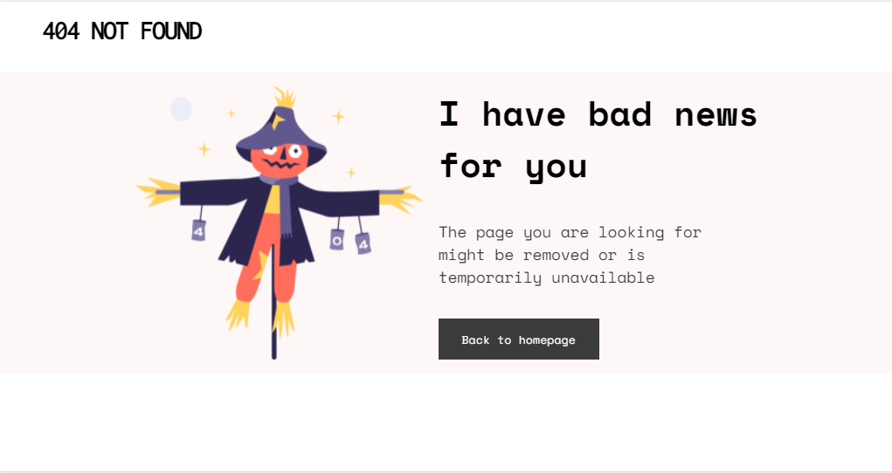
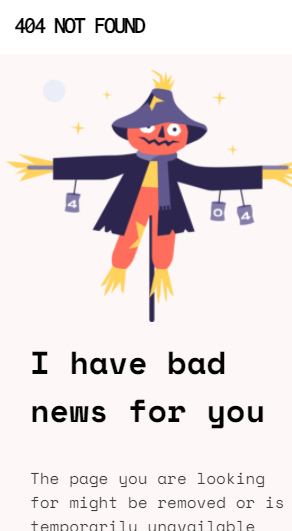
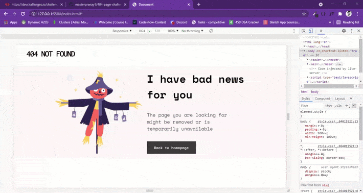

# DevChallenges Challenge ©

## 404 Page 

This is a solution to the challenge [404 Page on devchallenges](https://devchallenges.io/challengeswBunSb7FPrIepJZAg0sY)

## Table of Contents 📃

- [Overview](#overview)
    - [The Challenge](#the-challenge)
    - [Screenshots](#screenshots)
    - [Links](#links)
- [My Process](#my-process)
    - [Built With](#built-with)
    - [My Learnings](#my-learnings)
    - [Extras](#extras)
- [Author](#author)

## Overview

### The Challenge 😉

Create a 404 not found page following the design. The page should be responsive. Don’t look at the existing solution. Fulfill user stories below:

- <b>User Story</b>: I can see a page following the given design

### Screenshots 📷

#### Desktop

#### Mobile

#### Animations

### Links 🔗

- <b>Challenge Url :</b> [click here](https://devchallenges.io/challenges/wBunSb7FPrIepJZAg0sY)
- <b>Design Link :</b> [click here](https://www.figma.com/file/QeKWLNhB13zDjJzqR22TKE)
- <b>Solution Url : </b> [click here](https://github.com/masterpranay1/404-page-challenge)
- <b>Live Url : </b> [click here](https://masterpranay1.github.io/404-page-challenge/)

## My Process

### Built With

- Html5
- Pure Css
- Clean Code 🧼

### My Learnings

1. Flexbox (practice)
2. Media Queries
3. Responsive Images
4. Adding animations

### Extras

    I added animations to make things look cool.😎

## Author

    Hey!! I am Pranay Raj.
    I love to give these kind of small challenges to practice and sharpen my skills

    If you like this project. Consider starring this repo . ❤